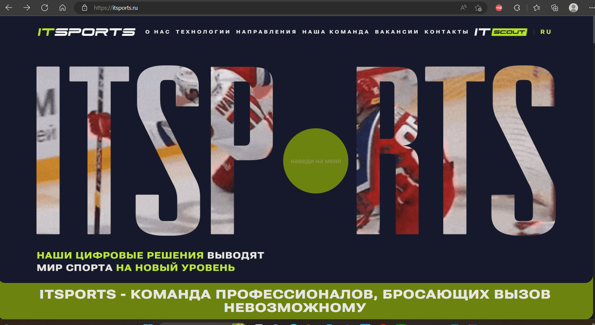

# *_План по проверке и автоматизации web сайта «ITSport»_*

>  
>

## _web сайт состоит и включает в себя следующий функционал:_

[//]: # (> 
)
> Раздел "Header"
>    - _Компоненты:_
>      - _кпопка перевода_
>   - _Функциолнал:_
>      - _Перевод страницы на русский и английский языки._

> Раздел "Header-MENU"
>    - _Компоненты:_
>      - _Навигиционная кнопка для перехода в раздел "О НАС"_
>      - _Навигиционная кнопка для перехода в раздел "ТЕХНОЛОГИИ"_
>      - _Навигиционная кнопка для перехода в раздел "НАПРАВЛЕНИЯ"_
>      - _Навигиционная кнопка для перехода в раздел "НАША КОМАНДА"_
>      - _Навигиционная кнопка для перехода в раздел "ВАКАНСИИ"_
>      - _Навигиционная кнопка для перехода в раздел "КОНТАКТЫ"_
>   - _Функциолнал:_
>      - _Переход к разделу "О НАС"._
>      - _Переход к разделу "ТЕХНОЛОГИИ"._
>      - _Переход к разделу "НАПРАВЛЕНИЯ"._
>      - _Переход к разделу "НАША КОМАНДА"._
>      - _Переход к разделу "ВАКАНСИИ"._
>      - _Переход к разделу "КОНТАКТЫ"._

> Раздел "О НАС"
>    - _Компоненты:_
>      - _кпопка стрелка влево_
>      - _кпопка стрелка вправо_
>   - _Функциолнал:_
>      - _Смена изображения._

> Раздел "НАШ СТЕК ТЕХНОЛОГИЙ МЕНЯЕТСЯ ОТ СИСТЕМЕ К СИСТЕМЕ"
>    - _Компоненты:_
>      - _Лента с движущимися иконками используемых приложений_
>   - _Функциолнал:_
>      - _Движение изображений слева на право._

> Раздел "НАПРАВЛЕНИЯ"
>    - _Компоненты:_
>      - _WEB АЗРАБОТКА_
>      - _IT OPERATION_
>      - _PRODUCT MANAGEMENT_
>      - _IOS И ANDROID РАЗРАБОТКА_
>      - _ПО ДЛЯ WINDOWS_
>      - _БРЕНДИНГ_
>      - _КОМПЬЮТЕРНОЕ ЗРЕНИЕ_
>   - _Функциолнал:_
>      - _Смена окон с описаниями направлений._

> Раздел "ПОЧЕМУ ВЫБИРАЮТ ИМЕННО НАС"
>    - _Компоненты:_
>      - _кпопка стрелка влево_
>      - _кпопка стрелка вправо_
>   - _Функциолнал:_
>      - _смена окон с изображениями._

> Раздел "РАСЧИТАЕМ ВАШ ПРОЕКТ И ПОДГОТОВИМ КОММЕРЧЕСКОЕ ПРЕДЛОЖЕНИЕ ЗА 3 ДНЯ"
>    - _Компоненты:_
>      - _форма с полями для ввода имени, номера телефона, email, сообщение, загрузки файлов, кнопка для отправки формы_
>   - _Функциолнал:_
>      - _заполнение полей._
>      - _отправка формы._

> Раздел "НАША КОМАНДА"
>    - _Компоненты:_
>      - _кпопка стрелка влево_
>      - _кпопка стрелка вправо_
>   - _Функциолнал:_
>      - _смена окон с анимированными изображениями._

> Раздел "КОНФЕРЕНЦИИ"
>    - _Компоненты:_
>      - __
>   - _Функциолнал:_
>      - _._

> Раздел "ВАКАНСИИ"
>    - _Компоненты:_
>      - _кпопка свернуть/развернуть описание вакансии_
>   - _Функциолнал:_
>      - _свернуть/развернуть описание вакансии._

> Раздел "ХОЧУ РАБОТАТЬ В ITSPORTS"
>    - _Компоненты:_
>      - _кнопка "Я В ДЕЛЕ"_
>      - _форма для заполнения и отправки заявки: "ОТКЛИКНУТЬСЯ НА ВАКАНСИЮ", чек-бокс, кнопка отправить, кнопка для закрытия формы_
>   - _Функциолнал:_
>      - _переход в форму._
>      - _заполнение полей, отправка формы, выставление галочки согласия на обработку данных, закрытие формы._

> Раздел "КОНТАКТЫ"
>    - _Компоненты:_
>      - _ссылка hello@itsports.ru_
>      - _ссылка @ITsports_ru_
>   - _Функциолнал:_
>      - _переход по ссылке hello@itsports.ru._
>      - _переход по ссылке @ITsports_ru._

> Раздел "FOOTER-NAV"
>    - _Компоненты:_
>      - _Навигиционная кнопка для перехода в раздел "О НАС"_
>      - _Навигиционная кнопка для перехода в раздел "ТЕХНОЛОГИИ"_
>      - _Навигиционная кнопка для перехода в раздел "НАПРАВЛЕНИЯ"_
>      - _Навигиционная кнопка для перехода в раздел "НАША КОМАНДА"_
>      - _Навигиционная кнопка для перехода в раздел "ВАКАНСИИ"_
>      - _Навигиционная кнопка для перехода в раздел "КОНТАКТЫ"_
>      - _Кнопка возвращения вверх страницы"_
>   - _Функциолнал:_
>      - _Переход к разделу "О НАС"._
>      - _Переход к разделу "ТЕХНОЛОГИИ"._
>      - _Переход к разделу "НАПРАВЛЕНИЯ"._
>      - _Переход к разделу "НАША КОМАНДА"._
>      - _Переход к разделу "ВАКАНСИИ"._
>      - _Переход к разделу "КОНТАКТЫ"._
>      - _Возвращение вверх страницы"._
> 
# Чек-лист:

### Проверка web сайта "_«ITSport»_"
>    - __Header__:
>    - Проверка элементов:
>      - Кнопка **переключатель языков**
>    - Проверка перевода текста
>    - __Header-MENU__:
>    - Проверка элементов:
>     - О НАС
>     - ТЕХНОЛОГИИ
>     - НАПРАВЛЕНИЯ
>     - НАША КОМАНДА
>     - ВАКАНСИИ
>     - КОНТАКТЫ
>    - Проверка перехода к разделам
>    - __Раздел "О НАС"__:
>    - Проверка элементов:
>      - _кпопка стрелка влево_
>      - _кпопка стрелка вправо_
>      - _цифры между кнопками 1, 2, 3, 4_
>    - Проверка работоспособности кнопок и цифр для смены контента
>    - __Раздел "ТЕХНОЛОГИИ"__:
>    - Проверка элементов:
>      - _бегущая строка с изображениями иконок_
>    - Проверка смены изображений 
>    - __Раздел "НАПРАВЛЕНИЯ"__:
>    - Проверка элементов:
>      - _WEB АЗРАБОТКА_
>      - _IT OPERATION_
>      - _PRODUCT MANAGEMENT_
>      - _IOS И ANDROID РАЗРАБОТКА_
>      - _ПО ДЛЯ WINDOWS_
>      - _БРЕНДИНГ_
>      - _КОМПЬЮТЕРНОЕ ЗРЕНИЕ_
>    - Проверка смены окон с соответствующим описанием направления при нажатии на направление
>    - __Окно "ПОЧЕМУ ВЫБИРАЮТ ИМЕННО НАС"__:
>    - Проверка элементов:
>      - _кпопка стрелка влево_
>      - _кпопка стрелка вправо_
>    - Проверка смены изображений
>    - __Форма "РАСЧИТАЕМ ВАШ ПРОЕКТ И ПОДГОТОВИМ КОММЕРЧЕСКОЕ ПРЕДЛОЖЕНИЕ ЗА 3 ДНЯ"__:
>    - Проверка элементов:
>      - _поле "Имя"_
>      - _поле "номер телефона"_
>      - _поле "email"_
>      - _поле "сообщение"_
>      - _поле "загрузки файлов,"_
>      - _кнопка "отправить"_
>    - Проверка заполнения полей
>    - Проверка отправки формы
>    - __Раздел "НАША КОМАНДА"__:
>    - Проверка элементов:
>      - _кпопка стрелка влево_
>      - _кпопка стрелка вправо_
>    - Проверка работоспособности кнопок
>    - __Раздел "КОНФЕРЕНЦИИ"__:
>    - Проверка элементов:
>      - _кпопка стрелка влево_
>      - _кпопка стрелка вправо_
>    - Проверка работоспособности кнопок, смена контента
>    - __Раздел "ВАКАНСИИ"__:
>    - Проверка элементов:
>      - _кпопка развернуть/свернуть_
>    - Проверка работоспособности кнопок, свертывание/развертывание описания вакансий
>    - __Раздел "ХОЧУ РАБОТАТЬ В ITSPORTS"__:
>    - Проверка элементов:
>      - _кпопка "Я В ДЕЛЕ"_
>    - Проверка работоспособности кнопоки для открытия формы "откликнуться на вакансию"_
>    - __Форма "откликнуться на вакансию"__:
>    - Проверка элементов:
>      - _поле "Имя"_
>      - _поле "номер телефона"_
>      - _поле "email"_
>      - _поле "загрузки файлов,"_
>      - _поле "ссылка на соцсети или резюме"_
>      - _чек-бокс_
>      - _кнопка "отправить"_
>    - Проверка заполнения полей
>    - Проверка выставления/снятия галочки в чек-боксе
>    - Проверка кнопки выхода/закрытия формы
>    - Проверка отправки формы
>    - __Раздел "КОНТАКТЫ"__:
>    - Проверка элементов:
>      - _ссылка hello@itsports.ru_
>      - _ссылка @ITsports_ru_
>    - Проверка кликабельности ссылки/перехода по ссылке
>    - __FOOTER-NAV__:
>    - Проверка элементов:
>     - _О НАС_
>     - _ТЕХНОЛОГИИ_
>     - _НАПРАВЛЕНИЯ_
>     - _НАША КОМАНДА_
>     - _ВАКАНСИИ_
>     - _КОНТАКТЫ_
>     - _Кнопка возвращения вверх страницы_
>    - Проверка перехода к разделам
>    - Проверка возвращения вверх страницы

## Уровни тестирования:

* _Модульное тестирование_ - проверка отдельно модулей **_Header, Header-MENU, О НАС, ТЕХНОЛОГИИ, НАПРАВЛЕНИЯ, НАША КОМАНДА, ВАКАНСИИ, КОНТАКТЫ, FOOTER-NAV._**

|

* _Интеграционное тестирование_ - проверка взаимодействия между компонентами **_Header, Header-MENU, О НАС, ТЕХНОЛОГИИ, НАПРАВЛЕНИЯ, НАША КОМАНДА, ВАКАНСИИ, КОНТАКТЫ, FOOTER-NAV_**

## Виды тестирования:

* Функциональное тестирование
* Кроссбраузерное тестирование
* Тестирование пользовательского интерфейса

## Перечень автоматизируемых сценариев:

- _Тестирование функциональности переходов к разделам_
- _Тестирование функциональности перевода текста_
- _Тестирование функциональности заполнения полей/отправки форм_
- _Тестирование функционала прокрутки изображений_
- _Тестирование функционала смены описания направлений_
- _Тестирование функционала развертывания/свертывания описаний вакансий_
  _Тестирование функционала перехода по ссылкам._
  _Тестирование функционала возвращения вверх страницы._

## Перечень используемых инструментов для автоматизации:

| **_Инструмент_**     | **_Описание_**                                                    |
|----------------------|-------------------------------------------------------------------|
| **_java_**           | язык програмирования для написания тестов                         |
| **_IntelliJ IDEA_**  | программа, для работы с кодом                                     |
| **_Selenide_**       | для работы с веб-страницей                                        |
| **_Gradle_**         | система автоматической сборки внутри android studio               |
| **_JUnit 5_**        | библиотека для тестирования                                       |
| **_Allure_**         | используем для наглядного изображения прохождения тестов и ошибок |
| **_Git_**            | система контроля версий                                           |
| **_GitHub_**         | для хранения тестов                                               |
| **_GitHub Action_**  | CI для непрерывной интеграции                                     |
| **_Microsoft Edge_** | браузер                                                           |                          

## Перечень и описание возможных рисков при автоматизации:

Возможна смена кода страницы либо css-селекторов, придется править код;  
Долгое открытие страницы сайта, либо вкладки;  
Недоступность сайта или страницы;  
Смена формы заполнения после какого-либо времени;  
Невозможность написания в форме некоторых букв ;  
Неоправданная стоимость автоматизации;  
Поиск id и прочих локаторов  

## Перечень необходимых разрешений:

Разрешение на тестирование страниц сайта с помощью автоматизированного ПО;  

## Перечень необходимых специалистов для автоматизации:

Специалист по автоматизированному тестированию;

## Интервальная оценка с учётом рисков (в часах):

Необходимое время на тестирование составляет 24 часов, с учетом рисков - 30 часов. 